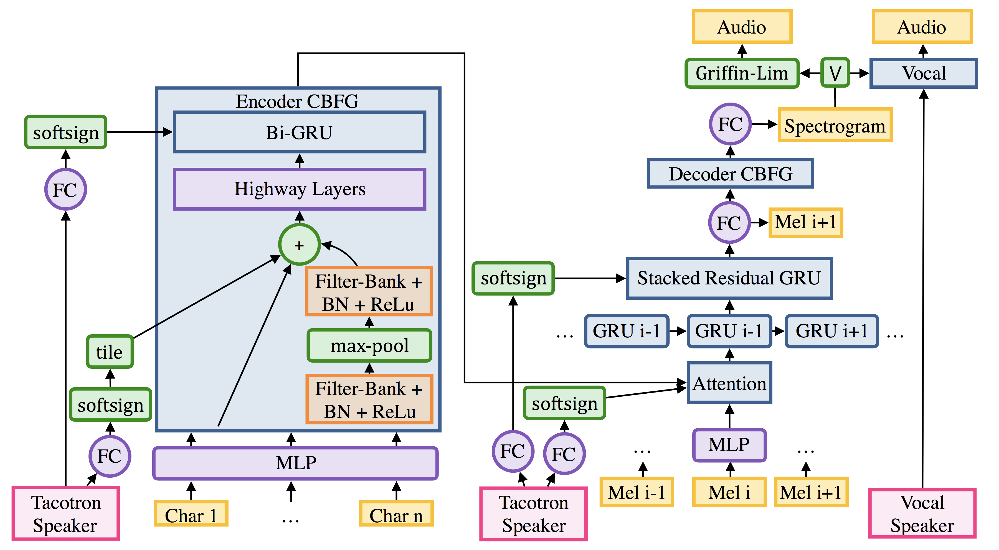
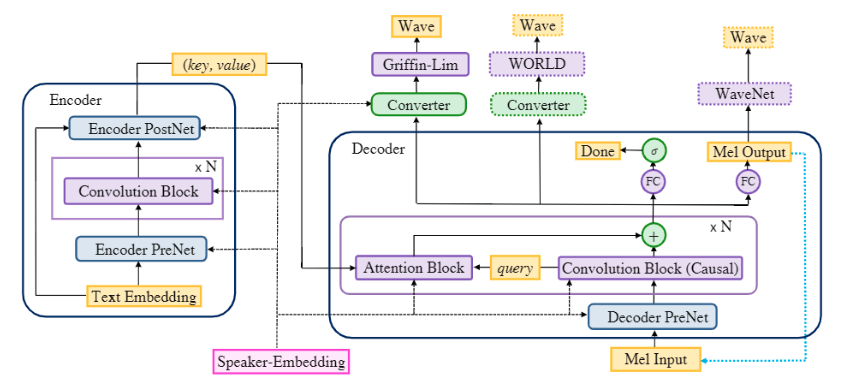

# tacotron-tensorflow
A TensorFlow implementation of DeepMind's Tacotron. A deep neural network architectures described in many papers.

Especially for English, Korean.

highly inspired by [here](https://github.com/Rayhane-mamah/Tacotron-2)

## Requirements

* Python 3.x
* Tensorflow 1.x
* librosa
* numpy
* tqdm

## Usage

## DataSet

|          DataSet          |     Samples    |          Size                 |
| :-----------------------: | :------------: | :---------------------------: |
|       IJSpeech-1.1        |      13100     |   about 30GB is needed        |

## Source Tree

## Model Architecture

### Tacotron 1

### Tacotron 2

### DeepVoice V2

soon!

### DeepVoice v3

## Author

HyeongChan Kim / [@kozistr](http://kozistr.tech)
