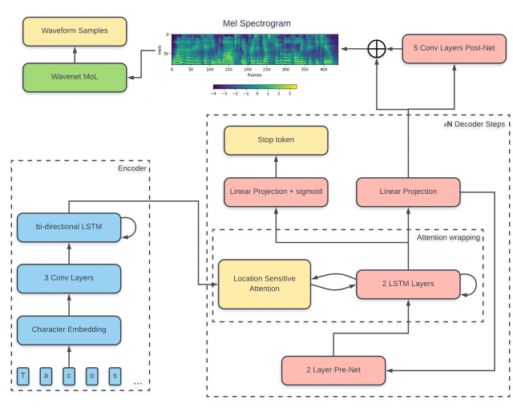

# tacotron-tensorflow
A TensorFlow implementation of DeepMind's Tacotron-2. A deep neural network architectures described in many papers.

Especially for Korean.

highly inspired by [here](https://github.com/Rayhane-mamah/Tacotron-2)

## Requirements

## Usage

## DataSet

## Source Tree

## Model Architecture

## Author

HyeongChan Kim [@kozistr](http://kozistr.tech)
